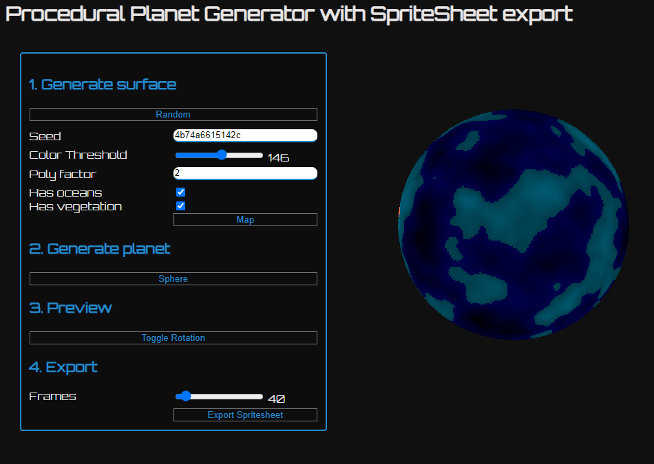

# Procedural Planet Generator /w export to SpriteSheet

## What this is

I needed a way to generate sprite-sheets for a [Phaser](https://phaser.io) project for coders
([ResourceMeJS](https://neoan.us/game)). Unfortunately, I was surprised to find the internet doesn't provide me with an easy to find solution.
So I just built what I needed:

[hosted @ https://sroehrl.github.io/planet-generator](https://sroehrl.github.io/planet-generator)

### Can I use it?

Yes, no contribution is necessary if you use assets generated. However, if you clone/copy my code,
please respect the license.

### Resources

- [Gaudiamus-Css](https://gaudiamus-css.github.io/)
- [Perlin Noise](https://en.wikipedia.org/wiki/Perlin_noise)
